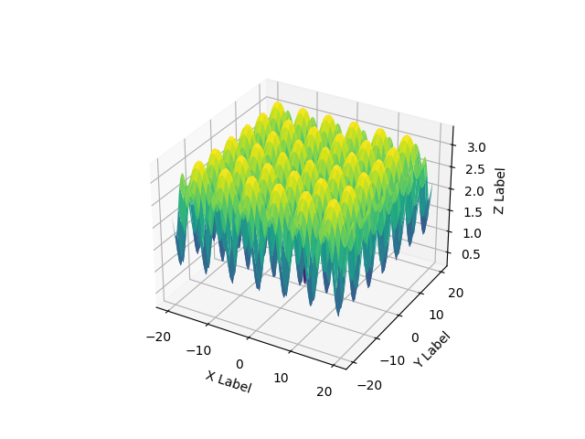
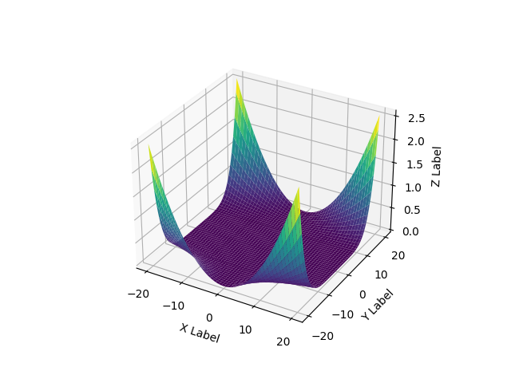

# Metaheuristics Course 

## Centro de Investigación en Computación

### Presented by Jorge Aldair Cortés López

In this work, its presented the implementation, explanation and visualization of the main swarm based algorithms.

The main codebase is taken from **SwarmPackagePy**, and in this fork this code is improved and adpated to works with python 3.12

------------------------------------------
Lista de funciones benchmark utilizadas:

1. Ackley function

2. Beale function

3. Beale function

4. Beale function

5. Beale function

6. Beale function

7. Beale function

8. Beale function

9. Beale function

10. Beale function

11. Beale function

12. Beale function

13. Beale function

14. Beale function

15. Beale function

16. Beale function

17. Beale function

